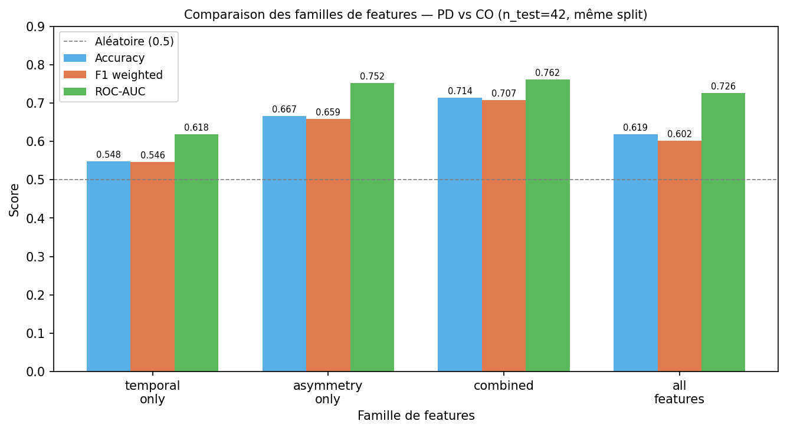
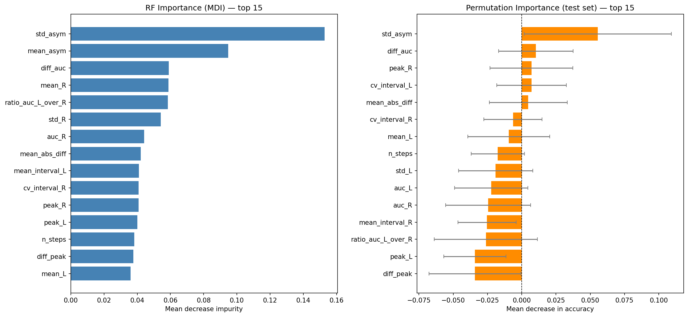
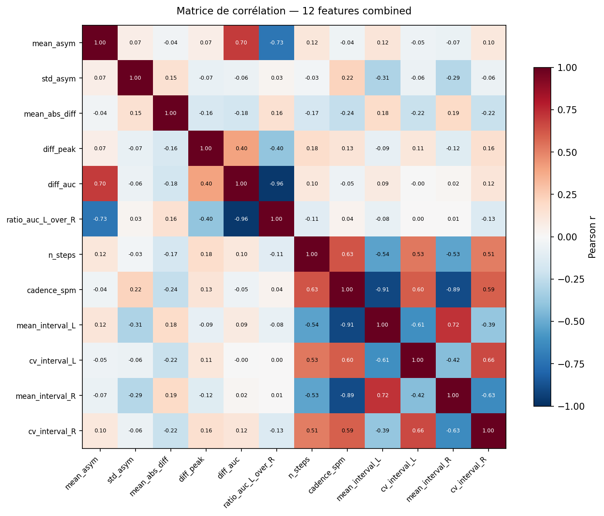

# Rapport d'avancement — Analyse du dataset gaitpdb

**Dataset :** Gait in Parkinson's Disease v1.0.0 (PhysioNet)  
**Tâche principale :** Classification PD vs CO  
**Tâche secondaire :** Régression UPDRSM (suspendue — cf. §4.2)  
**Modèle :** Random Forest (n_estimators=200, random_state=42)

---

## 1. Contexte et objectif

L'objectif est de déterminer si des descripteurs agrégés extraits des signaux de pression plantaire permettent de distinguer des patients parkinsoniens (PD) de sujets contrôles (CO), et d'estimer grossièrement la sévérité motrice via le score UPDRSM.

Deux familles de features sont comparées : les features d'**asymétrie gauche/droite** et les **proxies temporels** (cadence, intervalles entre pics de charge).

---

## 2. Données et périmètre expérimental

### 2.1 Dataset

Le dataset contient des enregistrements de pression plantaire (100 Hz, 16 capteurs par pied + total_L/total_R) collectés auprès de sujets parkinsoniens et contrôles, répartis sur trois études indépendantes.

| Étude | CO | PD | Total | Protocole |
|-------|----|----|-------|-----------|
| Ga    | 18 | 29 |    47 | Marche normale, dual-task |
| Ju    | 25 | 29 |    54 | Marche normale + RAS (métronome) |
| Si    | 29 | 35 |    64 | Marche normale |
| **Total** | **72** | **93** | **165** | |

### 2.2 Choix méthodologiques

- **Session retenue :** `01` uniquement (marche normale, sans protocole secondaire). Une session = un sujet à ce stade.
- **Filtre :** `has_signal == True`. Le sujet `Juc010` (présent dans les métadonnées mais sans fichier signal) est exclu des modèles, conservé dans l'index pour traçabilité.
- **Biais protocole :** La variable `study` (Ga/Ju/Si) est tracée dans toutes les sorties pour permettre la détection d'un éventuel effet protocole.
- **Split train/test :** Séparation 75/25, stratifiée sur le groupe PD/CO. Avec session=01, 1 ligne = 1 sujet, ce qui garantit l'absence de fuite de données. Le même split est utilisé pour toutes les comparaisons de familles de features.

### 2.3 Format des signaux

Chaque fichier `.txt` est un TSV sans en-tête, 19 colonnes, 100 Hz :

```
time  L1 L2 L3 L4 L5 L6 L7 L8  R1 R2 R3 R4 R5 R6 R7 R8  total_L  total_R
```

Les features sont calculées sur `total_L` et `total_R` (sommes des 8 capteurs par pied).

---

## 3. Features extraites

Les features sont calculées sur l'**enregistrement entier**, sans segmentation par cycle de marche. Chaque sujet produit un vecteur de features agrégées.

### 3.1 Features d'asymétrie (6)

Quantifient le déséquilibre gauche/droite dans la distribution de la pression plantaire.

| Feature | Formule / Description |
|---------|----------------------|
| `mean_asym` | Moyenne de `(R−L)/(R+L+ε)` sur l'enregistrement |
| `std_asym` | Écart-type de l'indice d'asymétrie |
| `mean_abs_diff` | `mean(|total_L − total_R|)` |
| `diff_peak` | `max(total_R) − max(total_L)` |
| `diff_auc` | `AUC(total_R) − AUC(total_L)` |
| `ratio_auc_L_over_R` | `AUC(total_L) / (AUC(total_R) + ε)` |

### 3.2 Features temporelles (6)

Basées sur la détection de pics de charge via `scipy.signal.find_peaks` (hauteur ≥ 20 % du maximum du signal, distance minimale 0.4 s = 40 échantillons à 100 Hz). Fiables pour la marche normale en ligne droite (session 01) ; 0 NaN sur les 165 sujets.

| Feature | Description |
|---------|-------------|
| `n_steps` | Nombre total de pics (L + R) |
| `cadence_spm` | Cadence en steps/min |
| `mean_interval_L` | Intervalle moyen entre pics gauches (s) |
| `cv_interval_L` | Coefficient de variation des intervalles gauches |
| `mean_interval_R` | Intervalle moyen entre pics droits (s) |
| `cv_interval_R` | Coefficient de variation des intervalles droits |

### 3.3 Familles définies

| Famille | Features | Source |
|---------|----------|--------|
| `asymmetry_only` | 6 features d'asymétrie | §3.1 |
| `temporal_only` | 6 features temporelles | §3.2 |
| `combined` | 12 = asymétrie + temporel | §3.1 + §3.2 |
| `all_features` | 20 = combined + force brute (mean_L/R, std_L/R, auc_L/R, peak_L/R) | — |

---

## 4. Résultats

### 4.1 Classification PD vs CO — baseline

Modèle entraîné sur les 20 features (`all_features`), split 75/25 stratifié.

| Tâche | n_train | n_test | Accuracy | F1 weighted | ROC-AUC |
|-------|---------|--------|----------|-------------|---------|
| PD vs CO | 123 | 42 | 0.619 | 0.602 | **0.726** |

### 4.2 Régression UPDRSM — résultats et suspension

La régression a été testée sur les sujets PD avec UPDRSM disponible (n=91 ; 2 exclus pour valeur manquante). Les résultats sont reproduits sur 5 seeds différentes.

| seed | n_test | MAE | RMSE | R² | Spearman r | p |
|------|--------|-----|------|----|------------|---|
| 42 | 23 | 6.787 | 7.925 | −0.195 | −0.054 | 0.808 |
| 0  | 23 | 7.213 | 9.008 |  0.010 |  0.181 | 0.410 |
| 123 | 23 | 8.168 | 9.365 | −0.827 | −0.300 | 0.164 |
| 7  | 23 | 7.894 | 8.936 | −0.140 | −0.170 | 0.438 |
| 1  | 23 | 6.651 | 7.849 | −0.127 | −0.052 | 0.813 |
| **Moy.** | | **7.3** | **8.6** | **−0.256** | **−0.079** | |

R² systématiquement négatif ou nul, corrélation de Spearman non significative (p > 0.16 dans tous les cas). **La régression UPDRSM est suspendue** : les features agrégées sur l'enregistrement entier ne capturent pas la sévérité motrice à ce niveau de granularité.

### 4.3 Vérification de l'effet protocole (étude)

Un classifieur logistique entraîné sur `study` (one-hot Ga/Ju/Si) comme unique prédicteur de PD/CO :

| Accuracy | F1 weighted | ROC-AUC |
|----------|-------------|---------|
| 0.571 | 0.416 | **0.553** |

AUC ≈ 0.55 : la variable `study` seule est quasi aléatoire pour prédire PD/CO. Aucun biais de protocole majeur détecté.

### 4.4 Généralisation inter-études (LOSO)

Validation leave-one-study-out : entraînement sur 2 études, test sur la 3ème. Modèle RF sur les 20 features.

| Étude tenue hors entraînement | n_test | Accuracy | F1 weighted | ROC-AUC |
|-------------------------------|--------|----------|-------------|---------|
| Ga | 47 | 0.638 | 0.640 | 0.628 |
| Ju | 54 | 0.630 | 0.628 | **0.685** |
| Si | 64 | 0.594 | 0.582 | 0.656 |

L'AUC LOSO (0.63–0.68) est inférieure à l'AUC split aléatoire (0.726), ce qui indique un léger sur-apprentissage intra-étude. Le signal reste néanmoins généralisable.

### 4.5 Comparaison des familles de features

Même split train/test pour toutes les familles (n_train=123, n_test=42).

| Famille | N features | Accuracy | F1 weighted | ROC-AUC |
|---------|------------|----------|-------------|---------|
| temporal_only | 6 | 0.548 | 0.546 | 0.618 |
| asymmetry_only | 6 | 0.667 | 0.659 | **0.752** |
| **combined** | **12** | **0.714** | **0.707** | **0.762** |
| all_features | 20 | 0.619 | 0.602 | 0.726 |



### 4.6 Importance des features

Importance RF (MDI) sur le modèle entraîné avec toutes les features :

| Rang | Feature | RF MDI | Famille |
|------|---------|--------|---------|
| 1 | `std_asym` | 0.153 | Asymétrie |
| 2 | `mean_asym` | 0.095 | Asymétrie |
| 3 | `diff_auc` | 0.059 | Asymétrie |
| 4 | `mean_R` | 0.059 | Force brute |
| 5 | `ratio_auc_L_over_R` | 0.058 | Asymétrie |
| 6 | `std_R` | 0.054 | Force brute |
| 7 | `auc_R` | 0.044 | Force brute |
| 8 | `mean_abs_diff` | 0.042 | Asymétrie |
| 9 | `mean_interval_L` | 0.041 | Temporel |
| 10 | `cv_interval_R` | 0.041 | Temporel |

Importance par permutation (test set, 30 répétitions) — seules les features avec perm_mean > 0 apportent un signal positif :

| Feature | perm_mean | ±std | Famille |
|---------|-----------|------|---------|
| `std_asym` | +0.056 | 0.054 | Asymétrie |
| `diff_auc` | +0.010 | 0.027 | Asymétrie |
| `peak_R` | +0.007 | 0.030 | Force brute |
| `cv_interval_L` | +0.007 | 0.025 | Temporel |
| `mean_abs_diff` | +0.005 | 0.028 | Asymétrie |



La matrice de corrélation des 12 features `combined` révèle les redondances internes :



Les features d'asymétrie sont fortement corrélées entre elles (`mean_asym`/`std_asym`/`mean_abs_diff`). Les features temporelles forment un second cluster cohérent (`cadence_spm`/`n_steps`/`mean_interval_L`/`mean_interval_R`). Les deux clusters sont faiblement corrélés, ce qui justifie leur complémentarité dans `combined`.

---

## 5. Interprétation

**L'asymétrie gauche/droite est le signal discriminant principal.** Avec 6 features d'asymétrie, le modèle atteint AUC=0.752, contre AUC=0.618 avec 6 features temporelles. La feature la plus informative est `std_asym` (variabilité de l'indice d'asymétrie au cours de la marche), cohérente avec la littérature sur l'asymétrie de la démarche parkinsonienne.

**Les features temporelles seules sont insuffisantes** à cette granularité (pas de segmentation par pas). Elles apportent cependant un gain marginal en complément de l'asymétrie : `combined` (+0.010 AUC vs `asymmetry_only`).

**Ajouter les features de force brute dégrade la performance** : `all_features` (20) est inférieur à `combined` (12) avec AUC=0.726 vs 0.762. Les features non-asymétriques (`mean_L`, `std_L`, `auc_L`, etc.) introduisent de la variance sans signal discriminant net.

**L'effet protocole est contrôlé.** La variable `study` seule produit AUC=0.553. La baisse d'AUC en LOSO (de 0.726 à 0.63–0.68) reflète une variabilité inter-protocole normale, pas un biais confondant.

---

## 6. Limites et suite logique

| Limite actuelle | Impact | Suite possible |
|----------------|--------|----------------|
| Features agrégées sur l'enregistrement entier (pas de segmentation par pas) | Features temporelles fragiles, UPDRSM non prédictible | Segmentation explicite par cycle de marche |
| COP (centre de pression) non exploité | Signal spatial non utilisé | Extraction de trajectoire COP L/R |
| Modèle unique (RF n=200) | Pas de comparaison de modèles | Ajouter LogisticRegression parcimonieuse, SVM |
| Session 01 uniquement | Périmètre réduit | Étendre aux sessions 02 et dual-task après validation |
| UPDRSM non prédictible avec features agrégées | Tâche de régression suspendue | À réouvrir avec features par pas |

La prochaine étape naturelle est la **sélection de features** (réduire à 5–6 features significatives) pour produire un modèle interprétable et testable sur des données externes, avant d'envisager des architectures plus complexes.

---

*Généré à partir des résultats dans `output/`. Modèle : Random Forest sklearn, Python 3.12.*
