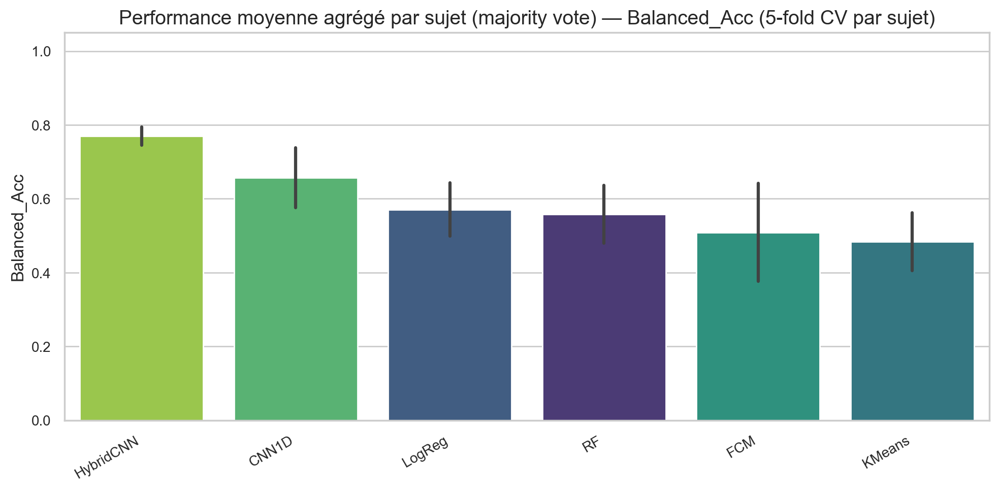
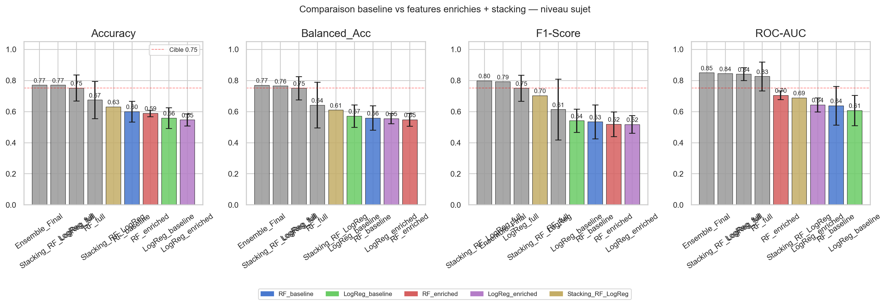
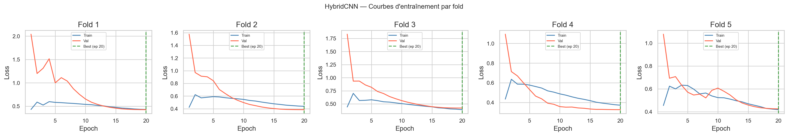
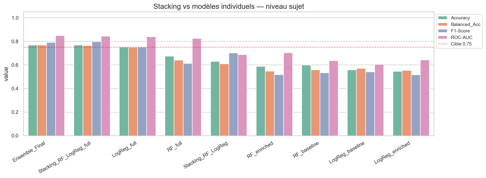

# Classification de la marche parkinsonienne par analyse de pression plantaire

**Matthieu Damien — ESEO E4 — Projet de Synthese 2026**


---

## Contexte et objectif

La maladie de Parkinson altere la marche de maniere caracteristique : asymetrie gauche/droite, reduction de la cadence, trainee du pied. Ces modifications sont detectables dans les signaux de pression plantaire.

**Objectif :** Classifier automatiquement des sujets parkinsoniens (PD) et controles (CO) a partir de signaux de capteurs de pression plantaire, et identifier les marqueurs biomecaniques les plus discriminants.

**Dataset :** Gait in Parkinson's Disease v1.0.0 (PhysioNet) — **165 sujets** (93 PD, 72 CO), 16 capteurs par pied a 100 Hz, 3 etudes independantes (Ga, Ju, Si).

---

## Methodologie

### 1. Segmentation et extraction de features

- **60 439 pas** segmentes a partir des signaux `total_L` / `total_R`
- Filtrage passe-bas Butterworth 10 Hz (zero-phase) pour le debruitage
- **45 features par pas** en 3 familles :
  - **Asymetrie et temporel** (15) : duree, peak force, asymetries intra-foulee
  - **Capteurs individuels** (30) : distribution spatiale de la pression, ratios avant-pied/talon, entropie de Shannon

### 2. Architecture HybridCNN

Un CNN hybride a fusion tardive combine le **signal brut** (16 canaux x 150 samples) et les **45 features tabulaires** :

```
Branche Signal (CNN 1D)          Branche Tabulaire (MLP)
Conv1d 16→32→64→64               Linear 45→32→32
+ BN + ReLU + Dropout            + ReLU + Dropout
→ embedding (64)                 → embedding (32)
            ↘                  ↙
           Concat → Linear(96→2)
```

- Data augmentation : scaling amplitude (x0.9–1.1) + bruit gaussien
- Classification au **niveau du pas** → agregation par majority vote au niveau sujet
- Validation : **StratifiedGroupKFold 5 folds** (pas de fuite inter-sujets)

### 3. Ensemble et optimisation

- Stacking RF + LogReg + HybridCNN → meta-classifieur LogReg (LOOCV sujet)
- Seuil de decision optimise par critere de Youden (J = Sensibilite + Specificite - 1)

---

## Resultats

L'analyse opere au **niveau du pas** (60 439 pas segmentes) : chaque modele classifie individuellement chaque pas PD/CO, puis les predictions sont agregees par **majority vote** au niveau sujet.

### Comparaison des modeles (classification par pas, agregation sujet)



*Le HybridCNN domine tous les modeles avec une faible variance inter-folds.*

### Progression des performances (pas-level → agregation sujet)

| Phase | Meilleur modele | Balanced Acc | ROC-AUC |
|---|---|---|---|
| Baseline | FCM clustering | 0.69 | 0.75 |
| Phase 2 — CNN1D + features enrichies | CNN1D | 0.66 | 0.75 |
| **Phase 3 — HybridCNN + capteurs** | **HybridCNN** | **0.77** | **0.87** |

### Performance detaillee des modeles



*Les modeles avec features capteurs (suffixe `_full`) depassent systematiquement la cible de 0.75.*

### Courbes d'entrainement du HybridCNN



*Convergence stable sur les 5 folds grace au dropout agressif (0.3 + 0.5) et a la data augmentation.*

### Vue d'ensemble — Stacking et ensembles



*L'Ensemble Final et le Stacking full franchissent la cible 0.75 sur toutes les metriques principales.*

---

## Contributions cles

| Axe                                                         | Gain                                                           |
| ----------------------------------------------------------- | -------------------------------------------------------------- |
| **Features par capteur individuel** (30 features spatiales) | **+18 pts** LogReg (0.57 → 0.75) — gain le plus important      |
| **CNN hybride** (signal + tabulaire)                        | **+11 pts** vs CNN1D (0.66 → 0.77)                             |
| **Seuil Youden** (0.62 vs 0.50)                             | **+6.6 pts** RF                                                |
| **Data augmentation**                                       | Stabilisation de l'entrainement (variance inter-folds reduite) |

---

## Conclusion et perspectives

- Le pipeline atteint **0.77 Balanced Accuracy** et **0.87 ROC-AUC** — un pouvoir discriminant eleve pour un dataset de 165 sujets
- Les **features par capteur** sont le levier principal : elles capturent la distribution spatiale de la pression (avant-pied/talon, asymetries par zone)
- Ces features offrent une **interpretabilite clinique directe** (SHAP, feature importance) : quels capteurs discriminent PD vs CO
- **Limite :** la taille du dataset (165 sujets, ~33 par fold de validation) contraint la generalisation
- **Perspective :** validation sur un dataset plus large (>500 sujets) et integration dans un outil d'aide au diagnostic precoce
